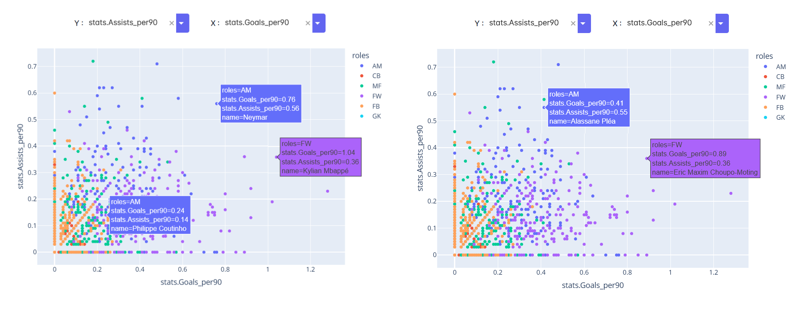
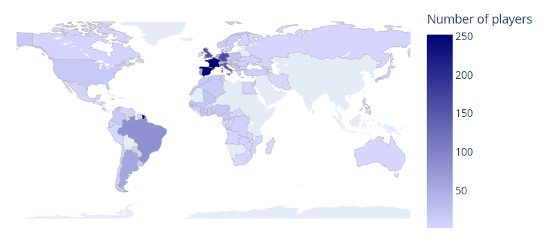
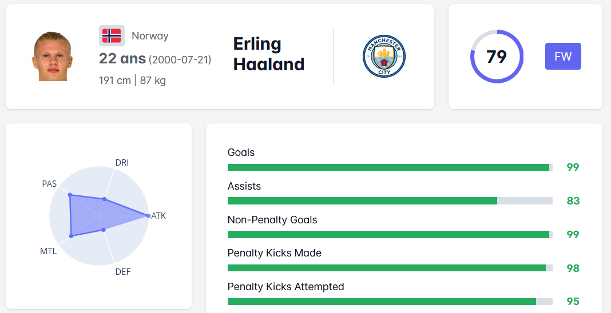
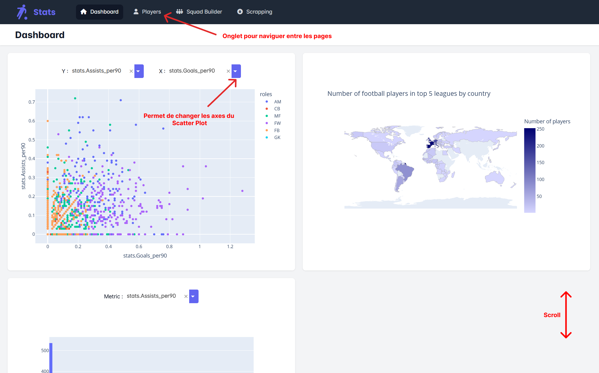
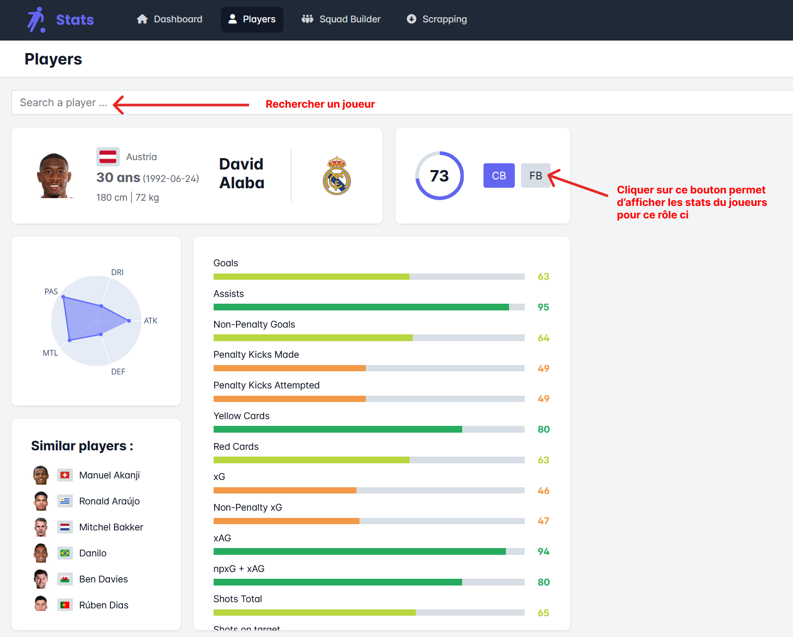
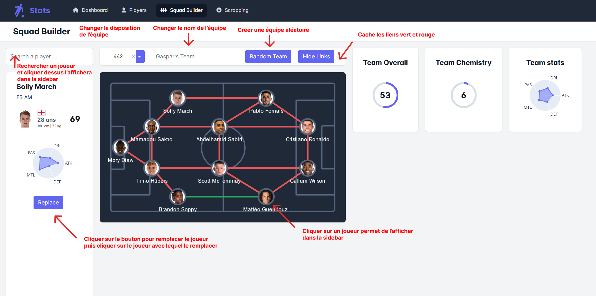
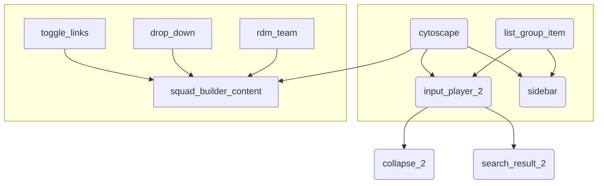

# Projet-Open-Source-Fbref
[](https://www.python.org/downloads/release/python-390/) <br>
Python Projet Data Visualization ESIEE 2022 <br>

[I. Présentation](#presentation)<br>
[II. Le projet](#project)<br>
[III. Analyses et conclusions](#conclusion)<br>
[IV. Guide installation (Install & Run)](#install-guide)<br>
[V. Guide utilisateur](#user-guide)<br>
[VI. Guide developpeur](#dev-guide)<br>

<a name="presentation"/>

## I. Présentation :

Le football est un sport passionnant et très populaire à travers le monde, avec des millions de fans et de nombreux joueurs. Les performances de ces joueurs peuvent être cruciales pour le succès d'une équipe, et il est donc important de pouvoir les évaluer de manière objective.
J'ai créé un dashboard avec des données publiques de joueurs de football provenant de [fbref.com](https://fbref.com/en/) en utilisant Python et dash. Le dashboard offre une vue d'ensemble détaillée des performances des joueurs de football et permet aux utilisateurs de comprendre les qualités et défauts de chaque joueur et leur impact sur l'équipe.

<a name="project"/>

## II. Le projet :

Le but de ce projet était de créer un dashboard en utilisant Python qui permettrait d'analyser et de mettre en valeur des données publiques Open Data sur un sujet d'intérêt public. Le code devait être structuré en plusieurs fichiers et exécuté dans un navigateur. Au minimum, le dashboard devait inclure un histogramme et une représentation géolocalisée, ainsi qu'au moins un graphique dynamique. <br>

J'ai choisi de travailler avec des données footballistiques provenant de bref, qui répertorient les statistiques de joueurs de cinq des plus grands championnats sur les 365 derniers jours. J'ai utilisé la bibliothèque Plotly Dash pour créer un dashboard qui permettrait de manipuler ces données et de les rendre plus accessibles. <br>

Le dashboard final comprend quatre pages, chacune ayant sa propre fonctionnalité : <br>

  - La page d'accueil présente un histogramme et une carte choroplèthe permettant de visualiser la répartition géographique des joueurs. Elle inclut également un scatter plot
  dynamique qui affiche les statistiques de chaque joueur ainsi qu’un histogram dynamique. <br>
  
  - La page joueur permet aux utilisateurs de rechercher un joueur en particulier et d'afficher ses informations et ses statistiques. Elle inclut également un graphique en
  forme de radar qui présente une note de défense, d'attaque, de dribble, de passe et de mental pour chaque joueur et un graphique camembert revisité pour afficher la note
  totale du joueur. <br>
  
  - La page squad builder permet aux utilisateurs de créer une équipe en sélectionnant des joueurs scrappés. Un dash cytoscape est utilisé pour représenter chaque joueur sous
  forme de nœud, et les liens entre les nœuds représentent la compatibilité entre les joueurs. La page inclut également un radar et une note générale. <br>

  - La page scrapping permet de lancer le scrapping des données pour mettre à jour les informations du dashboard. <br>
  

**Graphiques utilisés:**

  - Scatter Plot ( Dynamique )
  - Historgram ( Dynamique )
  - Carte Choroplèthe
  - Graph Radar ( Dynamique )
  - Camembert / Pie ( Dynamique )
  - Dash Cytoscape ( Dynamique )


<a name="conclusion"/>

## III. Analyses et conclusions :

Les résultats obtenus semblent être cohérents et reflètent bien les tendances actuelles du football. <br>

<br>



<br>

L'utilisation d'un scatter plot peut s'avérer très utile pour découvrir des joueurs qui se démarquent dans certains domaines. Par exemple, en utilisant les buts en tant qu'axe X et les passes décisives en tant qu'axe Y, on peut voir que des joueurs tels que Mbappé ou Neymar sont plus décisifs et importants que Coutinho, bien que tous jouent un rôle similaire. Cet exemple, bien que prévisible, montre l'efficacité de ce graphique qui permet de mettre en lumière des cas moins prévisibles, comme Choupo Moting et Alassane Pléa, qui ont tous les deux de très bonnes statistiques mais qui ne sont pas très médiatisés. <br>

<br>



<br>

La carte choroplète indique que la plupart des joueurs viennent d'Europe, en particulier de France et d'Espagne. Cela semble logique étant donné que les meilleurs clubs se trouvent en Europe. Cependant, il y a également un nombre significatif de joueurs provenant de pays comme le Brésil et l'Argentine, connus pour leur talentueux joueurs de football. La domination écrasante de l'Espagne et de la France pourrait indiquer que ces deux pays ont des centres de formation performants. <br>

<br>



<br>

Le graphique en forme de radar semble être assez cohérent lorsqu'on le compare aux caractéristiques des joueurs. Par exemple, prenons le cas d'Erling Haaland. Haaland est un buteur extrêmement prolifique qui ne manque pas une occasion de marquer. Son classement en tant que meilleur buteur de la Premier League, avec 7 buts d'avance sur le deuxième, témoigne de sa qualité de buteur. Cependant, sa taille de 1,91 mètre ne le rend pas très efficace au dribble, comme le montre le graphique. On peut voir qu'il excelle dans le domaine de l'attaque, mais qu'il a du mal au dribble.
En ce qui concerne sa note générale de joueur, 78, elle ne reflète peut-être pas pleinement son niveau. En effet, la note est calculée en fonction d'une liste de statistiques qui avantagent les joueurs polyvalents, mais désavantagent les autres. Il pourrait être intéressant de créer une liste de statistiques pour chaque type de buteur, afin que chaque joueur ait une note en fonction de son style de jeu.


<a name="install-guide"/>

## IV. Guide installation :

> :warning: **Ce projet a été créé avec python 3.9 mais devrait fonctionner pour toutes versions de python 3, si cela n'est pas le cas, utilisez python 3.9**
  
- **Premièrement, clonez le repo :**

  `$ git clone https://github.com/Gasmain/Projet-Open-Source-Fbref.git`
  
- **Rentrez dans le dossier :**
  
  `$ cd Projet-Open-Source-Fbref`

- **Ensuite, installez les dependances :**

  `$ pip install -r requirements.txt`

- **Puis lancez main.py pour demarrer l'app :**

  `$ python main.py`

- **Enfin, ouvrez le dashboard**

  visitez http://127.0.0.1:8050/ dans votre navigateur pour visualiser le dashboard

<a name="user-guide"/>

## V. Guide utilisateur :
  
  Voici des screenshots avec des explications pour utiliser l'interface du dashboard et ne pas rater de fonctionalités :
  
  <br>
  
  
  
  

  
  

<a name="dev-guide"/>

## VI. Guide developpeur :

**Scrapping :**

<br>

  Les data ont déja été scrappé pour un gain de temps et peuvent être trouvées ici : [data/player.json](https://github.com/Gasmain/Projet-Open-Source-Fbref/blob/master/data/player.json) mais peuvent être rescrappé via l'interface ou en rajoutant `Scrapper.scrap()` dans le main : 
  > :warning: **Le scrapping de données est très long** : il peut prendre plus de 5h
  
  ```Python
  if __name__ == '__main__':
      # Config logging output file
      logging.basicConfig(filename='logs/main.log', level=logging.DEBUG, format='%(asctime)s %(levelname)-8s %(message)s', datefmt='%Y-%m-%d %H:%M:%S')

      Scrapper.scrap() # <- cette ligne doit être présente si vous voulez scrapper avant de lancer le dashboard
  ```
  
Après un scrapping il est conseillé d'appeler `sf.build_data_frame()` et `sf.build_map_csv`. <br>
`sf.build_data_frame()` recréer les dataframes à partir du `fichier player.json`
`sf.build_map_csv` recréer le csv utilisé pour la map, cette fonction peut être longue car elle utilise `pycountry.countries.search_fuzzy()` <br>

<br>

**Ajouter des pages :**

<br>

Pour ajouter un page, créer un fichier python `my_new_page.py` dans le dossier `pages` se trouvant à la racine du projet. Si la page n'est pas dans se dossier, elle ne sera pas lu par dash. <br>
<br>

Dans le fichier `my_new_page.py` importé le module dash, enregistré la page et créer une methode layout qui retournera le contenu de votre page :

  ```Python
  import dash
  from dash import html, dcc, callback, Input, Output
  
  dash.register_page(__name__)  # Enregistre la page dans le server
  
  def layout():
    return "le contenu de ma page"  # Ici retourner le contenu de votre page

  ```

<br>

Une fois cela fait, votre page sera accessible via  http://127.0.0.1:8050/my_new_page <br>

Si vous souhaitez l'ajouter dans la bar de navigation du dashboard, dans le fichier `app.py` ajouté un nouveau `NavLink()` dans la fonction `create_nav_bar()` : <br>

  ```Python
  dbc.NavLink([dash.html.I(className="fa-solid fa-house", style={"margin-right": "10px"}), "Dashboard"],
                        href="/", active="exact"),
  dbc.NavLink([dash.html.I(className="fa-solid fa-user", style={"margin-right": "10px"}), "Players"],
              href="/players", active="exact"),
  dbc.NavLink(
      [dash.html.I(className="fa-solid fa-people-group", style={"margin-right": "10px"}), "Squad Builder"],
      href="/squad-builder", active="exact"),
  dbc.NavLink([dash.html.I(className="fa-solid fa-circle-down", style={"margin-right": "10px"}), "Scrapping"],
              href="/scrapping", active="exact"),
  
  # Votre nouvelle page ici : 
  dbc.NavLink([dash.html.I(style={"margin-right": "10px"}), "Ma nouvelle page"],
              href="/my_new_page", active="exact"),
              
  ```


  <br>
  
**Les callbacks :**

<br>

Les Callbacks sont tous relativement simple et peuvent être créer de cette manière :

<br>

```Python
@dash.callback(
    Output("id_of_output_element", "attribute_to_output"),
    Input("id_of_input_element", "attribute_to_input"),
)
def name_of_callback(value):
    # Ici le corps de votre fonction manipulant la valeur envoyé par l'input
    return "" # Ici la valeur a output dans l'attribut spécifié dans attribute_to_output
```

<br>

Seul les callbacks de la page `squad_builder.py` sont complexes, voici un graphique représentant leur fonctionement :

<br>
  


<br>

Si dans un callback vous ne souhaitez pas retourner de valeurs si une condition n'est pas remplie utilisez `raise dash.exceptions.PreventUpdate`
Cela ne produira pas d'output sans produire d'erreur de callback :

<br>

```Python
@dash.callback(
    Output("id_of_output_element", "attribute_to_output"),
    Input("id_of_input_element", "attribute_to_input"),
)
def name_of_callback(value):
    if value > 3 :
      return "Hello"
    else :
      raise dash.exceptions.PreventUpdate
```


 


